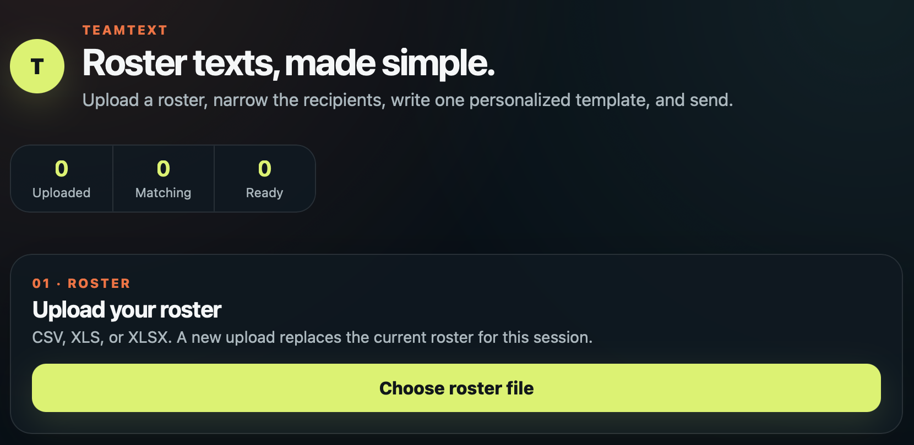

# TeamText

TeamText is a local, macOS-only app for sending personalized roster messages through Apple Messages. Upload a CSV or Excel roster, filter it to the people you need, preview each message, and then submit the batch from the Mac that is running TeamText.



TeamText supports two delivery modes:

- **One text per athlete** creates a separate personalized message for every included roster row.
- **One text per household (shared phone)** combines included rows that use the same phone number, so a parent with multiple athletes receives one message instead of duplicates.

> [!IMPORTANT]
> TeamText runs only on macOS. It controls the Messages app on the same logged-in, awake, and unlocked Mac. It is not a cloud texting service, a Linux/Windows app, or a delivery-confirmation service.

## Requirements

- A Mac running a currently supported version of macOS
- Apple Messages configured and able to send a message manually
- [Node.js](https://nodejs.org/) 20.19.x, or 22.12 or newer (Node 22 LTS recommended)
- Python 3.10 or newer
- `pip`, included with standard Python installations
- Git, only if downloading with `git clone`

To send SMS rather than iMessage, the Mac must already be able to send SMS through Messages, normally by using Text Message Forwarding from an iPhone. TeamText does not configure Apple accounts, iMessage, carrier service, or Text Message Forwarding.

## Download

### Download a ZIP

1. Open `https://github.com/APMonitor/TeamText`.
2. Select **Code**, then **Download ZIP**.
3. Extract `TeamText-main.zip`.
4. Open Terminal and change to the extracted folder:

   ```bash
   cd ~/Downloads/TeamText-main
   ```

### Clone with Git

```bash
git clone https://github.com/APMonitor/TeamText.git
cd TeamText
```

## Install

Run these commands from the TeamText folder:

```bash
npm install
npm run setup:python
```

The virtual environment does not need to be activated. TeamText automatically uses `.venv/bin/python` when that file exists.

## Grant macOS permission

TeamText uses UI automation to operate Messages, so macOS must allow the terminal application that starts TeamText to control the Mac.

1. Open **System Settings → Privacy & Security → Accessibility**.
2. Enable the terminal application you use, such as Terminal or iTerm.
3. Start TeamText and try a dry run or a small test batch.
4. If macOS displays an Automation prompt, allow the terminal application to control Messages and System Events.

If the terminal does not appear in the Accessibility list, use the **+** button to add it. After changing permissions, quit and reopen the terminal before trying again.

## Run

For normal use after installation:

```bash
npm start
```

`npm start` builds the current web interface and then starts TeamText. Open [http://127.0.0.1:4100](http://127.0.0.1:4100) in a browser on the same Mac. Leave the Terminal window running. Press `Control-C` in Terminal when you are finished.

For development, run the API and Vite development server together:

```bash
npm run dev
```

Then open [http://127.0.0.1:5173](http://127.0.0.1:5173).

### Test without sending messages

Dry-run mode exercises roster grouping and batch progress without opening Messages or sending anything:

```bash
SMS_DRY_RUN=1 npm start
```

Stop that process with `Control-C` and restart with `npm start` when you are ready to send real messages.

## Prepare a roster

TeamText accepts `.csv`, `.xls`, and `.xlsx` files. The first row must contain column names, and each remaining row should represent one athlete. Include at least:

- An athlete-name column
- A parent or guardian text-number column

Other columns—such as parent name, team, grade, event, or practice group—can be used as filters and message merge fields. Store phone numbers as text when possible; international E.164 format such as `+12025550101` is the least ambiguous.

Example roster:

| Athlete | Parent Name | Parent Phone | Team | Grade |
| --- | --- | --- | --- | --- |
| Ava Ramirez | Morgan Ramirez | +12025550101 | U12 Blue | 6 |
| Leo Ramirez | Morgan Ramirez | +12025550101 | U12 Blue | 4 |
| Jordan Lee | Taylor Lee | +12025550102 | U12 Blue | 5 |
| Casey Smith | Riley Smith | +12025550103 | U14 Gold | 8 |

The two Ramirez rows intentionally share a phone number. This allows household mode to combine Ava and Leo into a single message to Morgan.

A fabricated copy of this roster is included at [`examples/team-roster.example.csv`](examples/team-roster.example.csv). The numbers use the reserved `202-555-01xx` fictional range. Never commit or attach a real team roster.

## Send a message

1. Start TeamText and open its local URL.
2. Select **Choose roster file**, then choose a CSV or Excel file from your Mac. A new upload replaces the current roster for this browser session.
3. Confirm the **Athlete name column** and **Text number column** mappings.
4. Add filters to narrow the roster. Multiple filters are combined, so every active filter must match. You can also uncheck individual rows.
5. Choose **One text per athlete** or **One text per household (shared phone)**.
6. Enter a template name and message. Select the roster-field buttons to insert merge fields safely.
7. Read the message summary at the bottom. Rows with missing numbers, invalid merge fields, or other problems are skipped and identified there.
8. Keep the Mac awake and unlocked, avoid using the keyboard or mouse while the batch is active, and select **Send**.

Messages may take several seconds each because TeamText deliberately waits for Messages to open and become active before submitting the next text.

### Individual messages to each parent

Choose **One text per athlete** when every roster row should produce its own text. For the example roster, filter `Team` to `U12 Blue` and use:

```text
Hi {{parent_name}}, {{athlete}} has U12 Blue practice Tuesday at 5:00 PM. Please reply if they cannot attend.
```

The previews include:

```text
Hi Morgan Ramirez, Ava Ramirez has U12 Blue practice Tuesday at 5:00 PM. Please reply if they cannot attend.

Hi Morgan Ramirez, Leo Ramirez has U12 Blue practice Tuesday at 5:00 PM. Please reply if they cannot attend.

Hi Taylor Lee, Jordan Lee has U12 Blue practice Tuesday at 5:00 PM. Please reply if they cannot attend.
```

This mode sends three texts because three athlete rows match, even though two rows share Morgan's number.

### One household message for multiple athletes

Choose **One text per household (shared phone)** to agglomerate matching roster rows by normalized phone number. Duplicate formatting such as `(202) 555-0101` and `+1 202-555-0101` is treated as the same valid US number.

Household mode provides two special merge fields:

- `{{athlete_names}}` lists the distinct athlete names in that household naturally, such as `Ava Ramirez and Leo Ramirez`.
- `{{athlete_count}}` is the number of included athletes sharing that number.

Existing roster fields are also combined: identical values appear once, while different values become a natural-language list. For example, the two Ramirez rows share the same parent and team, so `{{parent_name}}` remains `Morgan Ramirez` and `{{team}}` remains `U12 Blue`.

Use this template:

```text
Hi {{parent_name}}, practice for {{athlete_names}} is Tuesday at 5:00 PM. Please reply if either athlete cannot attend.
```

Morgan receives one text:

```text
Hi Morgan Ramirez, practice for Ava Ramirez and Leo Ramirez is Tuesday at 5:00 PM. Please reply if either athlete cannot attend.
```

Taylor receives a separate text for Jordan. The bottom summary shows one preview per phone-number household before anything is sent.

Grouping happens after filters and row checkboxes are applied. If Leo is excluded, Morgan's preview contains only Ava. Review every grouped preview, especially when relatives share a number for reasons other than belonging to the same household.

## Pause, resume, and stop

- **Pause** requests a pause at the next safe point. The current Messages action may finish first.
- **Resume** continues a paused batch.
- **Stop** prevents remaining texts from starting after the current safe point.

If TeamText reports an **unknown** outcome after a connection failure or forced stop, inspect the conversation in Messages before retrying. Retrying without checking can send a duplicate.

## Privacy and local storage

- Roster files are read by the browser from the file you explicitly choose; TeamText does not scan its folder for rosters.
- Roster data, templates, previews, and run results stay in the current app session. TeamText has no database and does not maintain message history.
- A new upload replaces the in-memory roster, and closing the app/session clears TeamText's working state.
- Message targets are passed to the local Python sender at send time rather than saved to disk by TeamText.
- Apple Messages retains submitted messages and conversations according to its own settings. TeamText cannot remove or manage that history.

TeamText listens only on `127.0.0.1`, which means it is intended for the Mac running it. It has no user-account or password system. Do not expose it to the internet with port forwarding, a public reverse proxy, or a cloud host.

## macOS-only limitations

- TeamText requires Apple Messages, AppleScript, and macOS Accessibility/UI automation. It cannot run its sender on Linux, Windows, most NAS devices, or a typical cloud server.
- Messages are sent from the Apple account and devices configured in Messages on the host Mac.
- The host Mac must remain logged in, awake, unlocked, and available for the duration of the batch.
- UI automation is less robust than an official messaging API. Changing focus, dismissing Messages, permission prompts, macOS updates, or unexpected dialogs can interrupt a batch.
- A `Submitted` result means TeamText entered the text into Messages and initiated sending; it is not proof of carrier delivery or that the recipient read it.
- SMS availability, iMessage availability, carrier charges, rate limits, and recipient consent remain the user's responsibility.
- TeamText processes one active batch at a time and does not schedule unattended campaigns.
- TeamText is a local single-user utility. It does not provide remote access, user accounts, team permissions, shared templates, cloud synchronization, or message-history reporting.

Apple provides additional setup help for [Messages on Mac](https://support.apple.com/guide/messages/send-messages-icht35827/mac), [Accessibility permission](https://support.apple.com/guide/mac-help/allow-accessibility-apps-to-access-your-mac-mh43185/mac), [Automation permission](https://support.apple.com/guide/mac-help/mchl108e1718/mac), and [Text Message Forwarding](https://support.apple.com/102545).

## Troubleshooting

### `npm install` or `npm run build` fails

Check the installed versions:

```bash
node --version
npm --version
python3 --version
```

Update Node.js or Python if they do not meet the requirements, then run the installation commands again.

### The site does not open

Keep `npm start` running and open `http://127.0.0.1:4100`, not the development URL. If Terminal reports that port 4100 is already in use, stop the older TeamText process with `Control-C` before restarting.

### Messages does not open, focus, or send

1. Confirm Messages is signed in and can send the same recipient a manual message.
2. Recheck **Privacy & Security → Accessibility** for the terminal application.
3. Accept any pending Automation prompt.
4. Keep the Mac unlocked and do not change application focus during the batch.
5. Restart TeamText and test with one recipient before sending a large batch.

### A phone number is skipped

Confirm that the correct text-number column is selected and that the number is valid. Prefer a full number such as `+12025550101`; avoid extensions, notes, or multiple numbers in one cell.

### Merge fields appear literally or are reported as unknown

Insert fields using the buttons below the message editor. Field names are derived from roster headers: for example, `Parent Name` becomes `{{parent_name}}`. A field from an older roster remains unknown after a different roster is uploaded until it is removed or replaced.

### A batch was interrupted

Use the bottom status summary and inspect Messages. Do not automatically resend entries marked **Unknown**. Because TeamText deliberately has no saved history, results are not available after the session ends.

## Updating a cloned copy

From the repository folder:

```bash
git pull
npm install
.venv/bin/python -m pip install -r requirements.txt
npm run build
```

If the virtual environment no longer exists, recreate it with the installation steps above.

## License

TeamText is available under the [MIT License](LICENSE).
